# FocusStartFinal
## iOS проект FocusStart - 2020

### Первый экран TabBar-а:

Список заведений и список любимых мест(место может быть добавлено в "любимые места" только если пользователь авторизован)

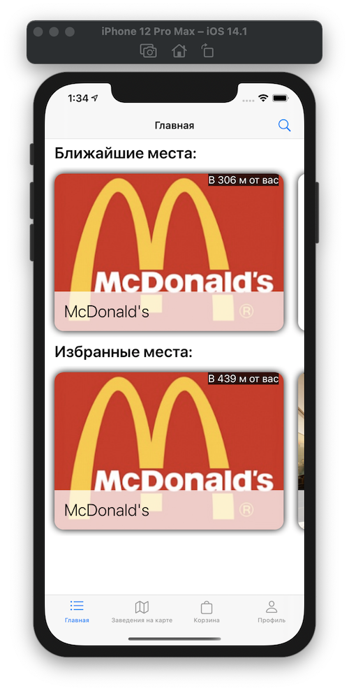

Поиск заведения(возможен поиск по категориям: по всем категориям/фаст-фуд/кофейни):

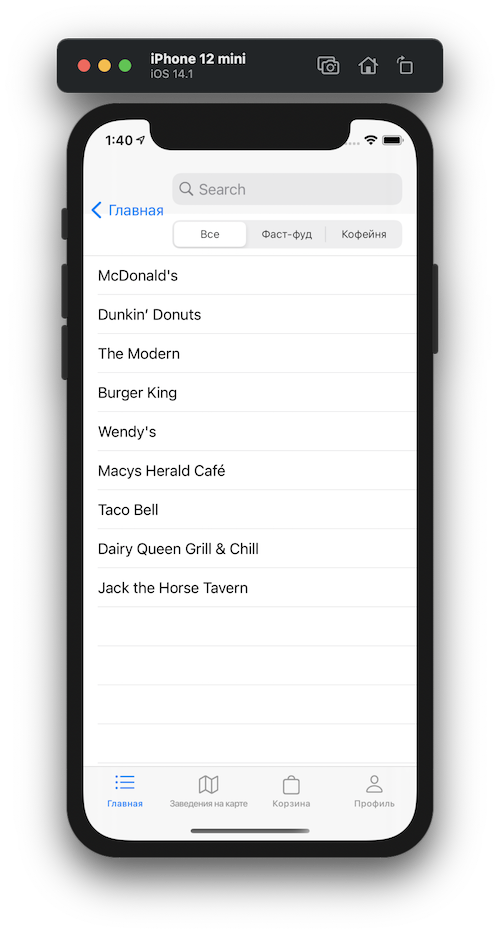

Экран подробной информации о заведении:

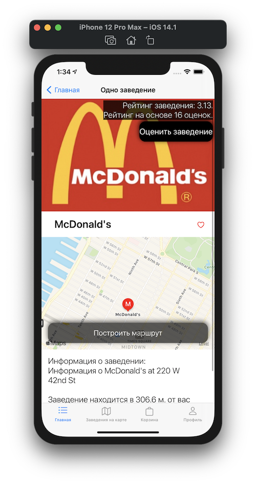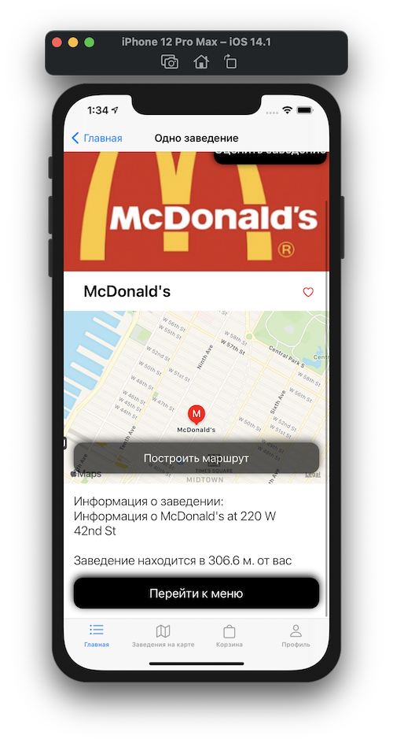

Возможность оценить заведение(доступна только для авторизованных пользователей)

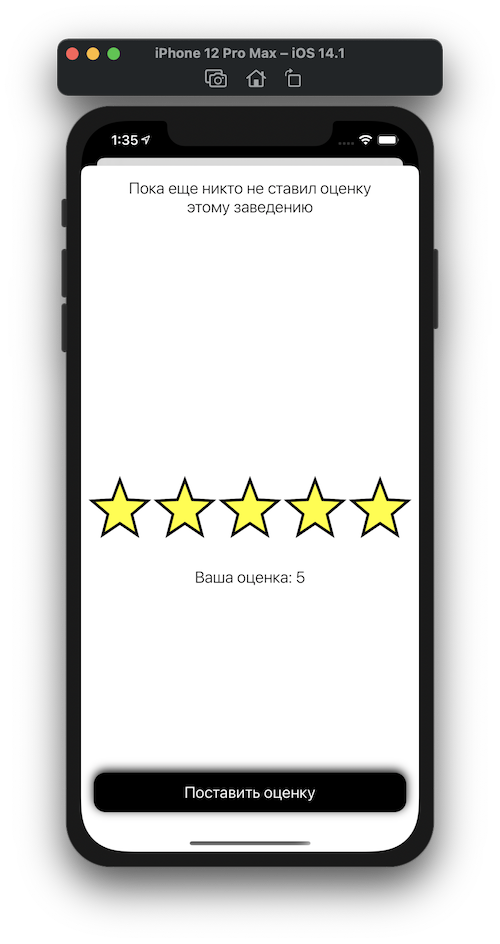

Меню заведения:

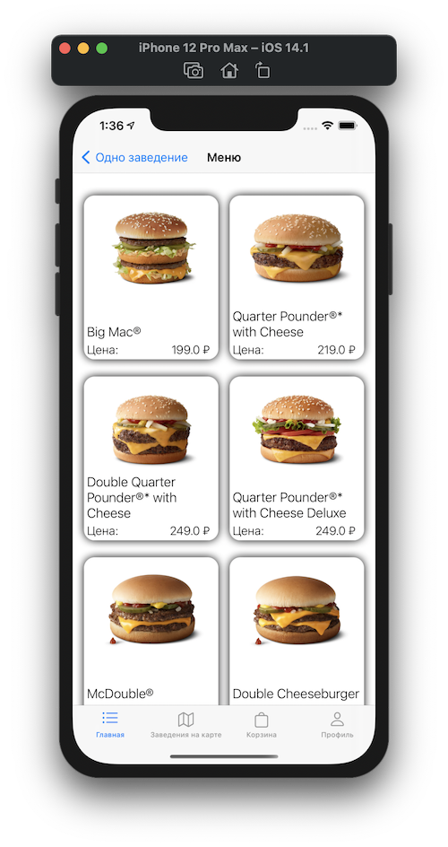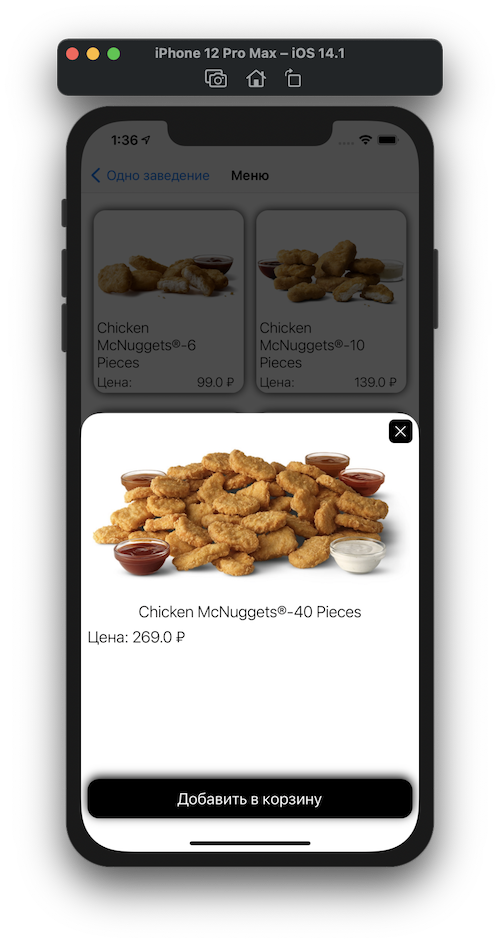

### Второй экран TabBar-а:

Возможность просмотра заведений по карте и переход к экрану подробной информации о заведении:

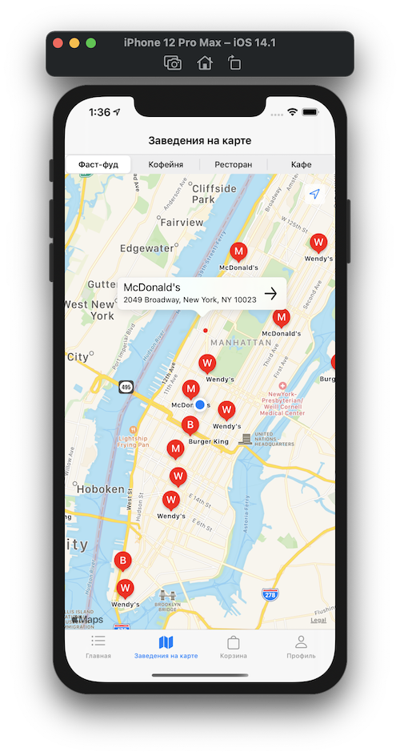

### Третий экран TabBar-а:

Корзина с добавленными товарами:

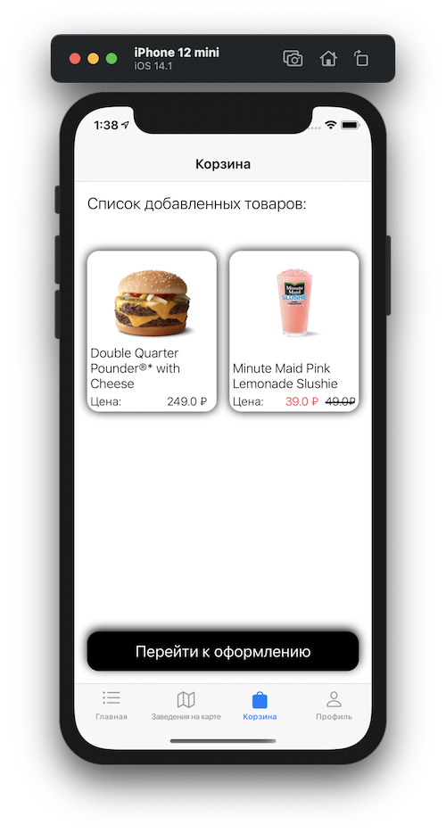

Процесс оформления заказа:

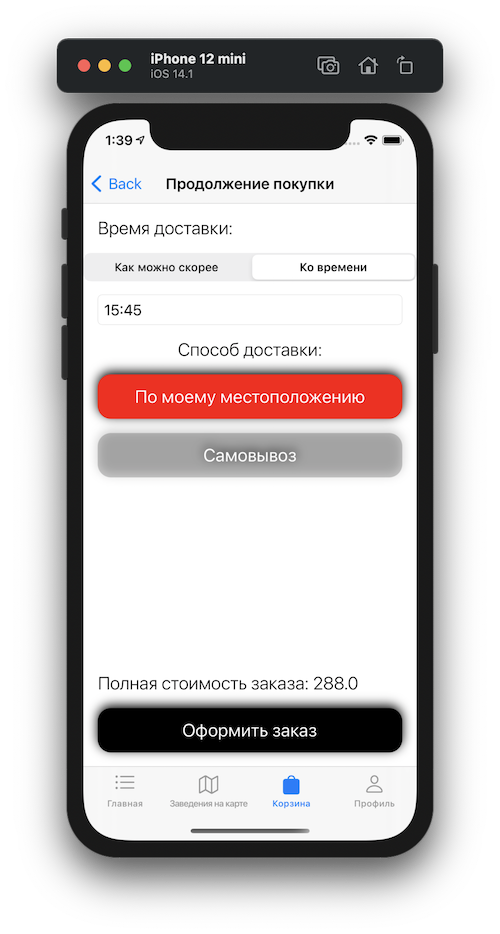

### Четвертый экран TabBar-а:

Экран регистрации/авторизации:

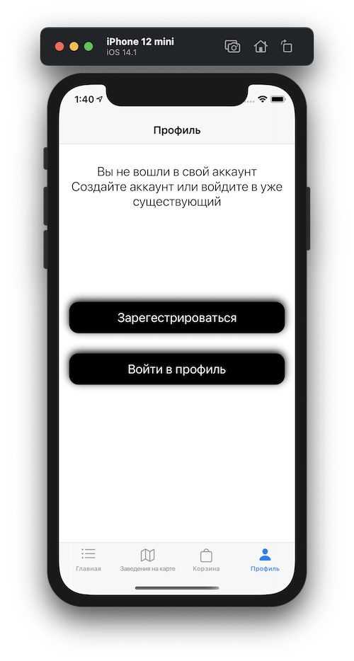

Внешний вид экрана пользователя со списком заказов:

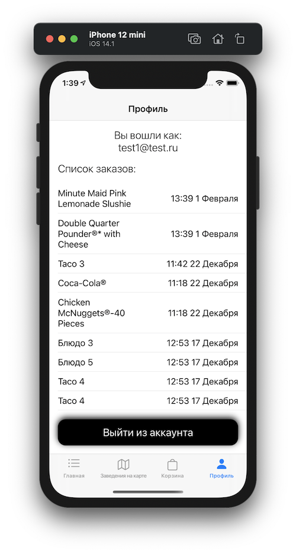

Информация об одном из заказов в истории заказов:

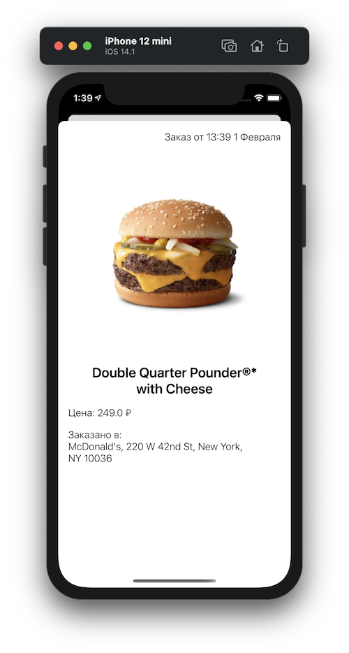

